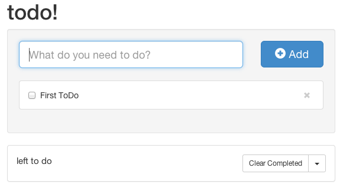

# GoInstant (GoAngular) ToDo App

This repository demonstrates the use of [GoAngular](https://developers.goinstant.com/v1/GoAngular/index.html) to create an example todo app.



View the [live demo of this code here](https://goangular-todo.herokuapp.com/).

## Running the Demo Yourself


### Initial Setup


##### 1. Install and configure the [Heroku toolbelt](https://toolbelt.heroku.com)
##### 2. Create a heroku app

```
heroku apps:create yourtodoapp
```

##### 3. Add the GoInstant Add-on to the app

```
heroku addons:add goinstant
```

**Note**: The Heroku addon is currently in alpha testing! Please email [contact@goinstant.com](mailto:contact@goinstant.com) to request alpha access.

##### 4. Continue via either the Local Setup or Heroku Setup

### Local Setup


If you'd like to work on the todo demo on your local machine, you'll need to do some setup.

#### Prerequisites

You must have node js v0.10+ installed.

#### Setup

##### 1. Execute `npm install` from the repo root

##### 2. Install the [heroku-config](https://github.com/ddollar/heroku-config) plugin.

```
heroku plugins:install git://github.com/ddollar/heroku-config.git
```

##### 3. Pull the heroku config (This is required for foreman to access the config variables).

```
heroku config:pull
```

##### 4. Execute `foreman start` from repo root to start the application

### Heroku Setup


Following initial setup, you simply have to push to the heroku git master to launch the app, below are a few different ways

##### Push Master
Normal or First Push

`git push heroku master`

##### Push Branch
To push your branch your working on

`git push heroku branchname:master`

#### Push Tag
To push a existing tag, note that this will not work unless you have already initialized the remote repo.

`git push heroku v1.0.0^{}:master`


#### Adding Heroku Repos

```
heroku git:remote -a <prod repo name>
heroku git:remote -a <stg repo name>
```


# Powered by GoInstant

<a href="http://goinstant.com">GoInstant</a> is an API for integrating realtime, multi-user functionality into your app.
You can check it out and <a href="https://goinstant.com/signup">sign up for free</a>.

# Legal

&copy; 2013 GoInstant Inc., a salesforce.com company

Licensed under the 3-clause BSD license, see `LICENSE` file for details.
